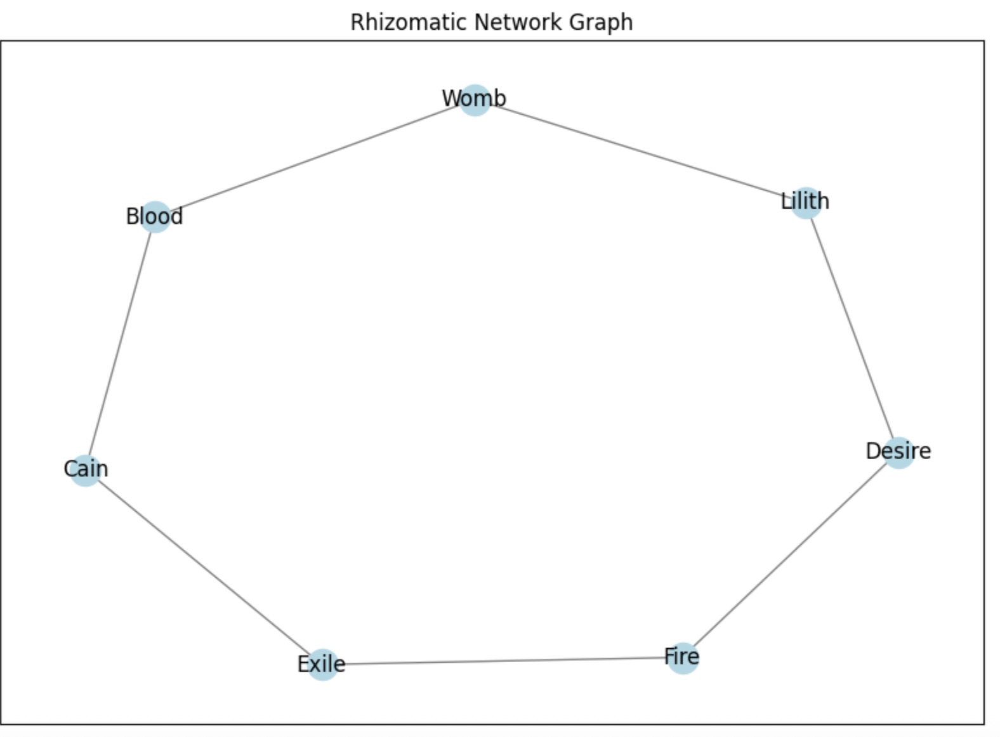

# Rhizomatic Networks of Desire

This project explores the intersection of data science and post-structuralist philosophy through the lens of **graph theory** and **network analysis**. Inspired by *A Thousand Plateaus* by Gilles Deleuze and Félix Guattari, it models how ideas and symbols form **non-hierarchical, rhizomatic structures** across language and thought.

## 🧠 Theoretical Framework

> “A rhizome ceaselessly establishes connections between semiotic chains, organizations of power, and circumstances relative to the arts, sciences, and social struggles.”  
> — *A Thousand Plateaus*

Unlike traditional tree-like models of knowledge (arborescent), rhizomatic structures are:
- **Non-linear**
- **Acentric**
- **Always in motion**

This project uses data analytics tools to trace how **desire, concepts, and discourse** connect and rupture in a graph of intensities, not identities.

## 🧰 Methodology

- **Corpus**: A curated body of text (Reddit posts, essays, or personal writing)
- **Preprocessing**: NLP (stop word removal, tokenization)
- **Node Definition**: Concepts, symbols, or named entities
- **Edges**: Based on proximity/co-occurrence in same sentence or paragraph
- **Graph Tools**: `networkx`, `matplotlib`, `pyvis`

### Key Metrics:
- **Degree Centrality** → Intensity
- **Betweenness Centrality** → Deterritorialized linkage
- **Clusters** → Plateaus

## 📈 Sample Visualization

This network visualizes symbolic connections like *Lilith → Womb → Blood → Exile → Desire*, modeled as a non-hierarchical system of conceptual intensities in the spirit of Deleuze and Guattari’s rhizomatic thought.

👉 [Open the full Jupyter notebook](notebooks/RhizomeGraph.ipynb)

👉 Click the badge to launch the notebook in a live, interactive Binder environment.

## 📌 Project Goals

- Build a living model of symbolic drift and conceptual entanglement
- Visualize post-structural flows of desire as non-hierarchical networks
- Offer a model of *schizoanalysis* as a data practice

## 🔮 Future Work

- Expand corpus to include other post-structural authors
- Explore real-time social media streams (e.g., Twitter/X) to map emergent rhizomes
- Add dynamic visualization interface (Streamlit or Shiny)

## 📚 References

- Deleuze & Guattari — *A Thousand Plateaus*
- Foucault — *The Archaeology of Knowledge*
- Derrida — *Dissemination*
- Lyotard — *The Postmodern Condition*

---
MIT License
